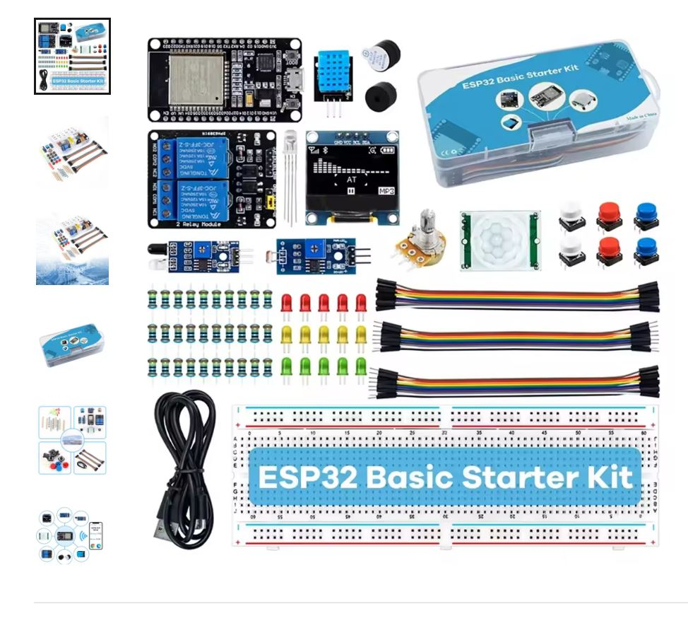

# ESP Projects Setup
- Install VSCode
- Install PlataformIO Extension
- Configure your USB Driver: CH340 ou CP210x.

# Build and Upload
- Go to the project folder
- Type: pio run --targer upload

# Monitor
- Type: pio device monitor

# Kit used

# Project Reference

# Tutorials

